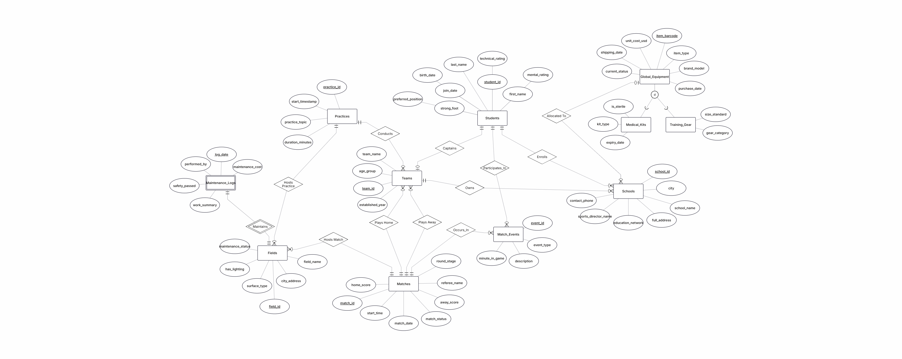
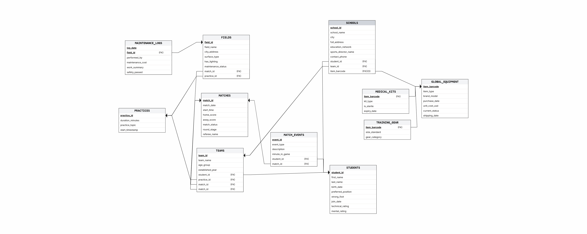
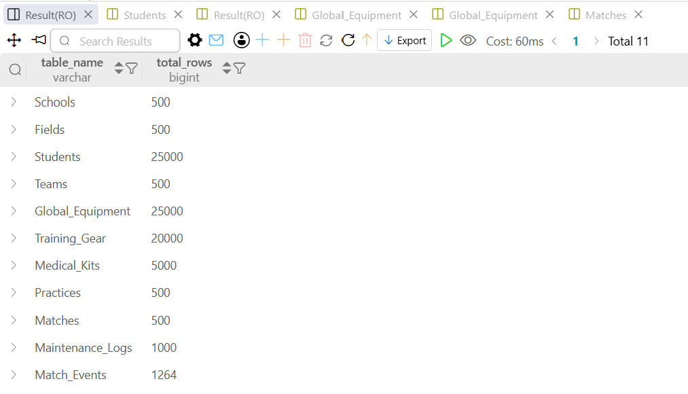
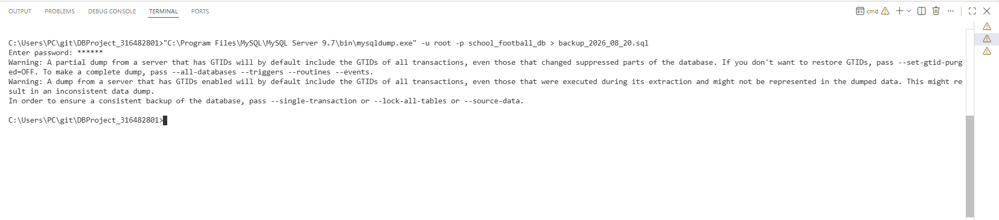
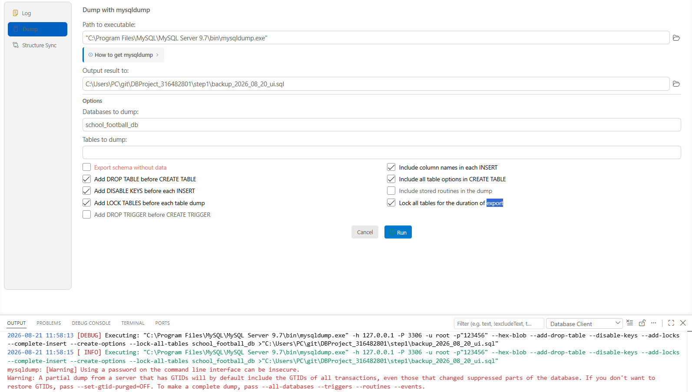

# Database Systems Project – Stage A
## School Football Management System (`school_football_db`)

**Student Name:** Nerya Cohen | **Student ID:** 316482801  
**Submission Date:** 20/08/2026  
**Environment:** MySQL 8.x / 9.x, VS Code, SQL, Python 3.13, ERDPlus  

---

## 1. System Overview & Architecture

This database system manages an extensive national school football league, integrating athletic, administrative, and logistical operations:
- **Institutions & Teams:** Tracks participating schools, age-bracketed teams, and team captains.
- **Athletes & Performance:** Maintains detailed profiles for students, playing positions, strong-foot attributes, and technical/mental ability ratings.
- **Scheduling & Fixtures:** Manages official match schedules, live scores, round stages, referee assignments, and training sessions across designated sports facilities.
- **Advanced Logistics & Specialization ($ISA$):** Manages a global equipment inventory with complete disjoint inheritance into specialized training gear and certified medical kits.
- **In-Game Analytics ($M:N$):** Tracks detailed live match occurrences (goals, cards, substitutions) linking athletes directly to individual competitive fixtures.
- **Facility Maintenance (Weak Entity):** Records periodic safety inspections and structural maintenance logs uniquely identified in association with individual sports venues.

The database is normalized to **Third Normal Form (3NF)** to eliminate data redundancy and preserve strict referential integrity.

---

## 2. System Diagrams

### 2.1 Entity Relationship Diagram (ERD)
Conceptual model displaying 11 entities, attributes, primary/partial keys, relationship cardinalities, associative entities, and inheritance hierarchies using Chen's notation.



---

### 2.2 Relational Schema Diagram (DSD)
Logical model depicting physical relational tables, column data types, Primary Keys (PK), Foreign Keys (FK), and referential constraints.



---

## 3. Data Dictionary

The database consists of 11 relational tables populating a total of **79,764 records**.

### Table 1: `Schools`
Represents participating educational institutions (500 rows).
| Column Name | Data Type | Constraints / Defaults | Description |
| :--- | :--- | :--- | :--- |
| `school_id` | `INT` | `PRIMARY KEY`, `AUTO_INCREMENT` | Unique identifier for each school |
| `school_name` | `VARCHAR(100)` | `NOT NULL` | Name of the educational institution |
| `city` | `VARCHAR(50)` | `NOT NULL` | City where the school is located |
| `full_address` | `VARCHAR(255)` | `NOT NULL` | Complete street address |
| `education_network` | `VARCHAR(50)` | `NOT NULL` | Associated educational network |
| `sports_director_name` | `VARCHAR(100)` | `NOT NULL` | Name of the sports department director |
| `contact_phone` | `VARCHAR(20)` | `NOT NULL` | Administrative contact phone number |

---

### Table 2: `Fields`
Represents sports venues and match fields (500 rows).
| Column Name | Data Type | Constraints / Defaults | Description |
| :--- | :--- | :--- | :--- |
| `field_id` | `INT` | `PRIMARY KEY`, `AUTO_INCREMENT` | Unique field identifier |
| `field_name` | `VARCHAR(100)` | `NOT NULL` | Facility/field name |
| `city_address` | `VARCHAR(100)` | `NOT NULL` | Physical location and street address |
| `surface_type` | `ENUM` | `NOT NULL` ('Natural Grass', 'Artificial Turf', 'Hybrid') | Playing surface material |
| `has_lighting` | `ENUM` | `NOT NULL` ('Yes', 'No') | Night lighting availability flag |
| `maintenance_status` | `ENUM` | `NOT NULL` ('Operational', 'Needs Renovation', 'Closed') | Operational readiness status |

---

### Table 3: `Students` (Large Table #1)
Represents enrolled student-athletes (25,000 rows).
| Column Name | Data Type | Constraints / Defaults | Description |
| :--- | :--- | :--- | :--- |
| `student_id` | `VARCHAR(10)` | `PRIMARY KEY` | Unique student identification number |
| `first_name` | `VARCHAR(50)` | `NOT NULL` | Student first name |
| `last_name` | `VARCHAR(50)` | `NOT NULL` | Student last name |
| `birth_date` | `DATE` | `NOT NULL` | Date of birth |
| `school_id` | `INT` | `NOT NULL`, `FK` $\rightarrow$ `Schools(school_id)` | Enrolled school reference |
| `preferred_position` | `ENUM` | `NOT NULL` ('Goalkeeper', 'Defender', 'Midfielder', 'Forward') | Tactical playing position |
| `strong_foot` | `ENUM` | `NOT NULL` ('Right', 'Left', 'Both') | Dominant playing foot |
| `join_date` | `DATE` | `NOT NULL` | Registration date in the league |
| `technical_rating` | `INT` | `CHECK (1 TO 100)` | Assessed technical skill rating |
| `mental_rating` | `INT` | `CHECK (1 TO 100)` | Assessed mental/tactical rating |

---

### Table 4: `Teams`
Represents school football squads across age tiers (500 rows).
| Column Name | Data Type | Constraints / Defaults | Description |
| :--- | :--- | :--- | :--- |
| `team_id` | `INT` | `PRIMARY KEY`, `AUTO_INCREMENT` | Unique team identifier |
| `team_name` | `VARCHAR(100)` | `NOT NULL` | Official team name |
| `school_id` | `INT` | `NOT NULL`, `FK` $\rightarrow$ `Schools(school_id)` | Represented school |
| `captain_student_id` | `VARCHAR(10)` | `NOT NULL`, `UNIQUE`, `FK` $\rightarrow$ `Students` | Assigned team captain (1:1 relation) |
| `age_group` | `ENUM` | `NOT NULL` ('U12', 'U14', 'U16', 'U18') | Age bracket |
| `established_year` | `INT` | `NOT NULL`, `CHECK (1900 TO 2026)` | Team founding year |

---

### Table 5: `Global_Equipment` (Superclass / Large Table #2)
Represents the league's global equipment inventory (25,000 rows).
| Column Name | Data Type | Constraints / Defaults | Description |
| :--- | :--- | :--- | :--- |
| `item_barcode` | `VARCHAR(64)` | `PRIMARY KEY` | Unique scannable barcode string |
| `brand_model` | `VARCHAR(100)` | `NOT NULL` | Manufacturer and model identifier |
| `purchase_date` | `DATE` | `NOT NULL` | Procurement date |
| `unit_cost_usd` | `DECIMAL(8,2)` | `NOT NULL`, `CHECK (unit_cost_usd > 0)` | Unit purchase cost in USD |
| `current_status` | `ENUM` | `NOT NULL` ('Operational', 'Under Repair', 'Needs Inspection', 'In Central Warehouse') | Equipment condition status |
| `school_id` | `INT` | `NULL`, `FK` $\rightarrow$ `Schools(school_id)` | Allocated school (`NULL` = Central Warehouse) |
| `shipping_date` | `DATE` | `NULL`, `CHECK (shipping_date >= purchase_date)` | Delivery dispatch date |

---

### Table 6: `Training_Gear` (Inheritance Subtype #1)
Specialized athletic training inventory (20,000 rows).
| Column Name | Data Type | Constraints / Defaults | Description |
| :--- | :--- | :--- | :--- |
| `item_barcode` | `VARCHAR(64)` | `PRIMARY KEY`, `FK` $\rightarrow$ `Global_Equipment` | Referenced parent equipment barcode |
| `gear_category` | `ENUM` | `NOT NULL` ('Balls', 'Cones', 'Vests', 'Agility Ladders', 'Goal Nets') | Specific category of training item |
| `size_standard` | `ENUM` | `NOT NULL` ('Size 4', 'Size 5', 'Standard', 'Junior') | Equipment size specification |

---

### Table 7: `Medical_Kits` (Inheritance Subtype #2)
Specialized medical and first-aid inventory (5,000 rows).
| Column Name | Data Type | Constraints / Defaults | Description |
| :--- | :--- | :--- | :--- |
| `item_barcode` | `VARCHAR(64)` | `PRIMARY KEY`, `FK` $\rightarrow$ `Global_Equipment` | Referenced parent equipment barcode |
| `kit_type` | `ENUM` | `NOT NULL` ('First Aid Kit', 'Ice Packs & Strapping', 'Bandages & Tape', 'Defibrillator & AED Kit') | Type of emergency medical supply |
| `expiry_date` | `DATE` | `NOT NULL` | Medical safety expiration date |
| `is_sterile` | `BOOLEAN` | `NOT NULL`, `DEFAULT TRUE` | Sterility compliance certification flag |

---

### Table 8: `Practices`
Represents scheduled team training sessions (500 rows).
| Column Name | Data Type | Constraints / Defaults | Description |
| :--- | :--- | :--- | :--- |
| `practice_id` | `INT` | `PRIMARY KEY`, `AUTO_INCREMENT` | Unique practice session ID |
| `team_id` | `INT` | `NOT NULL`, `FK` $\rightarrow$ `Teams(team_id)` | Participating team |
| `field_id` | `INT` | `NOT NULL`, `FK` $\rightarrow$ `Fields(field_id)` | Training venue |
| `practice_date` | `DATE` | `NOT NULL` | Scheduled session date |
| `start_time` | `TIME` | `NOT NULL` | Scheduled start time |
| `duration_minutes` | `INT` | `NOT NULL`, `CHECK (duration_minutes > 0)` | Session duration in minutes |
| `practice_topic` | `VARCHAR(100)` | `NOT NULL` | Main tactical/physical focus |

---

### Table 9: `Matches`
Represents official competitive fixtures (500 rows).
| Column Name | Data Type | Constraints / Defaults | Description |
| :--- | :--- | :--- | :--- |
| `match_id` | `INT` | `PRIMARY KEY`, `AUTO_INCREMENT` | Unique match identifier |
| `home_team_id` | `INT` | `NOT NULL`, `FK` $\rightarrow$ `Teams(team_id)` | Designated home team |
| `away_team_id` | `INT` | `NOT NULL`, `FK` $\rightarrow$ `Teams(team_id)` | Designated away team |
| `field_id` | `INT` | `NOT NULL`, `FK` $\rightarrow$ `Fields(field_id)` | Match venue |
| `match_date` | `DATE` | `NOT NULL` | Scheduled fixture date |
| `start_time` | `TIME` | `NOT NULL` | Kickoff time |
| `home_score` | `INT` | `NOT NULL DEFAULT 0`, `CHECK (home_score >= 0)` | Goals scored by home team |
| `away_score` | `INT` | `NOT NULL DEFAULT 0`, `CHECK (away_score >= 0)` | Goals scored by away team |
| `match_status` | `ENUM` | `NOT NULL` ('Completed', 'Scheduled', 'Postponed', 'In Progress') | Match status |
| `round_stage` | `ENUM` | `NOT NULL` ('Round 1', 'Round 2', 'Round 3', 'Quarter Final', 'Semi Final', 'Final') | Tournament stage |
| `referee_name` | `VARCHAR(100)` | `NOT NULL` | Appointed match official |

---

### Table 10: `Maintenance_Logs` (Weak Entity)
Represents venue safety and repair logs identifying with `Fields` (1,000 rows).
| Column Name | Data Type | Constraints / Defaults | Description |
| :--- | :--- | :--- | :--- |
| `field_id` | `INT` | `PRIMARY KEY`, `FK` $\rightarrow$ `Fields(field_id)` | Parent sports field identifier |
| `log_date` | `DATE` | `PRIMARY KEY` (Partial Key Discriminator) | Date when maintenance occurred |
| `performed_by` | `VARCHAR(100)` | `NOT NULL` | Contractor / maintenance agency |
| `maintenance_cost` | `DECIMAL(8,2)` | `NOT NULL`, `CHECK (maintenance_cost >= 0)` | Total cost incurred in USD |
| `work_summary` | `VARCHAR(255)` | `NOT NULL` | Log description and work executed |
| `safety_passed` | `BOOLEAN` | `NOT NULL DEFAULT TRUE` | Safety clearance certification flag |

---

### Table 11: `Match_Events` (Associative Entity / $M:N$)
Represents recorded live match actions connecting students and matches (1,264 rows).
| Column Name | Data Type | Constraints / Defaults | Description |
| :--- | :--- | :--- | :--- |
| `event_id` | `INT` | `PRIMARY KEY`, `AUTO_INCREMENT` | Unique event identifier |
| `match_id` | `INT` | `NOT NULL`, `FK` $\rightarrow$ `Matches(match_id)` | Associated match fixture |
| `student_id` | `VARCHAR(10)` | `NOT NULL`, `FK` $\rightarrow$ `Students(student_id)` | Associated student-athlete |
| `minute_in_game` | `INT` | `NOT NULL`, `CHECK (minute_in_game BETWEEN 1 AND 120)` | Match minute of occurrence |
| `event_type` | `ENUM` | `NOT NULL` ('Goal', 'Yellow Card', 'Red Card', 'Assist', 'Substitution') | Recorded event classification |
| `description` | `VARCHAR(255)` | `NULL` | Contextual event narrative/notes |

---

## 4. Data Generation & Ingestion Methodology

The dataset was synthesized and ingested using three complementary methodologies:

1. **Categorical Entity Frameworks:** Initial business models and domains modeled via normalized reference sets.
2. **Programmatic Data Generation Pipeline (`insert.py`):** Custom Python engine ensuring referential integrity, accurate foreign key mapping, valid subtype partitioning, and realistic domain distributions across 79,764 total rows.
3. **Direct SQL Data Manipulation (`insertTables.sql`):** Consolidated, structured DML batch transactions executing in strict dependency hierarchy order.

### 4.1 Programmatic Data Generation Pipeline (`insert.py`)

The dataset was generated using an optimized Python pipeline that constructs batch transactions across all 11 tables to ensure sub-second ingestion and strict constraint compliance:

```python
import random
from datetime import datetime, timedelta

# Helper data arrays
cities = ["Jerusalem", "Tel Aviv", "Haifa", "Beer Sheva", "Netanya", "Petah Tikva", "Ashdod", "Rishon LeZion", "Holon", "Bat Yam", "Rehovot", "Kfar Saba", "Herzliya", "Ranana", "Modihin", "Eilat", "Nazareth", "Afula", "Tiberias", "Safed"]
networks = ["AMAL", "ORT", "AMIT", "Independent", "Municipal", "Bnei Akiva", "Tzafon", "Hazorim", "Tzvia", "Noam"]
first_names = ["Noam", "Uri", "David", "Ariel", "Eitan", "Daniel", "Yosef", "Omer", "Itamar", "Lior", "Maya", "Tamar", "Noa", "Shira", "Yael", "Sara", "Roni", "Talia", "Hadas", "Michal", "Aviv", "Eden", "Gal", "Noga", "Rivka", "Moshe", "Yonatan", "Shlomo", "Yitzhak", "Maor", "Erez", "Alon", "Yair", "Nadav", "Itai", "Tal", "Oren", "Nerya"]
last_names = ["Cohen", "Levi", "Mizrahi", "Peretz", "Biton", "Dahan", "Avraham", "Friedman", "Malka", "Azulay", "Katz", "Gabai", "Shitrit", "Ben David", "Avramovich", "Man", "Averman", "Bachar", "Burstein", "Cohen-Avrahami", "Dayan", "Farkash", "Hazan", "Israeli", "Kahana", "Lifshitz", "Maimon", "Paz", "Rabinovich", "Saban"]
surfaces = ["Natural Grass", "Artificial Turf", "Hybrid"]
positions = ["Goalkeeper", "Defender", "Midfielder", "Forward"]
feet = ["Right", "Left", "Both"]
equip_brands = ["Nike", "Adidas", "Puma", "Select", "Uhlsport", "Molten"]
equip_statuses = ["Operational", "Under Repair", "Needs Inspection", "In Central Warehouse"]
practice_topics = ["Tactical Positioning", "High Pressing", "Set Pieces", "Endurance & Speed", "Ball Control", "Defensive Line Transitions", "Attacking Patterns", "Team Cohesion Drills", "Goalkeeper Training", "Fitness & Agility"]
match_statuses = ["Completed", "Scheduled", "Postponed", "In Progress"]
rounds = ["Round 1", "Round 2", "Round 3", "Quarter Final", "Semi Final", "Final"]
referees = ["Alon Yefet", "Liran Liany", "Roi Reinshreiber", "Eitan Shmuelevitz", "Orel Grinfeld", "Gal Leibovich"]

# Specialized categories
gear_categories = ["Balls", "Cones", "Vests", "Agility Ladders", "Goal Nets"]
gear_sizes = ["Size 4", "Size 5", "Standard", "Junior"]
kit_types = ["First Aid Kit", "Ice Packs & Strapping", "Bandages & Tape", "Defibrillator & AED Kit"]
maintenance_companies = ["GreenField Turf Ltd", "ProGrass Solutions", "Metro Stadium Services", "SafePlay Maintenance"]
event_types = ["Goal", "Yellow Card", "Red Card", "Assist", "Substitution"]

def random_date(start_year, end_year):
    start = datetime(start_year, 1, 1)
    end = datetime(end_year, 12, 31)
    return (start + timedelta(days=random.randint(0, (end - start).days))).strftime("%Y-%m-%d")

def write_bulk_inserts(file_handle, table_name, columns, rows_data, chunk_size=1000):
    cols_str = ", ".join(columns)
    for i in range(0, len(rows_data), chunk_size):
        chunk = rows_data[i:i + chunk_size]
        values_str = ",\n".join(chunk)
        file_handle.write(f"INSERT INTO {table_name} ({cols_str}) VALUES\n{values_str};\n\n")

with open("../step1/insertTables.sql", "w", encoding="utf-8") as f:
    f.write("-- School Football League Database Complete Mass Insert Script (11 Tables)\n")
    f.write("USE school_football_db;\n")
    f.write("SET AUTOCOMMIT = 0;\n")
    f.write("SET FOREIGN_KEY_CHECKS = 0;\n")
    f.write("SET UNIQUE_CHECKS = 0;\n\n")

    # 1. Schools (500)
    schools_data = []
    for s_id in range(1, 501):
        city = random.choice(cities)
        name = f"{random.choice(first_names)} {random.choice(last_names)}"
        schools_data.append(f"({s_id}, '{city} School #{s_id}', '{city}', '{random.randint(1,100)} Main St', '{random.choice(networks)}', '{name}', '050-{random.randint(1000000,9999999)}')")
    write_bulk_inserts(f, "Schools", ["school_id", "school_name", "city", "full_address", "education_network", "sports_director_name", "contact_phone"], schools_data)

    # 2. Fields (500)
    fields_data = []
    for f_id in range(1, 501):
        city = random.choice(cities)
        fields_data.append(f"({f_id}, '{city} Arena #{f_id}', '{random.randint(1,100)} Sports Ave', '{random.choice(surfaces)}', '{random.choice(['Yes', 'No'])}', '{random.choice(['Operational', 'Needs Renovation', 'Closed'])}')")
    write_bulk_inserts(f, "Fields", ["field_id", "field_name", "city_address", "surface_type", "has_lighting", "maintenance_status"], fields_data)

    # 3. Students (25,000)
    student_ids = [f"{i:09d}" for i in range(100000001, 100025001)]
    students_data = []
    for st_id in student_ids:
        students_data.append(f"('{st_id}', '{random.choice(first_names)}', '{random.choice(last_names)}', '{random_date(2008, 2014)}', {random.randint(1, 500)}, '{random.choice(positions)}', '{random.choice(feet)}', '{random_date(2024, 2026)}', {random.randint(30, 99)}, {random.randint(30, 99)})")
    write_bulk_inserts(f, "Students", ["student_id", "first_name", "last_name", "birth_date", "school_id", "preferred_position", "strong_foot", "join_date", "technical_rating", "mental_rating"], students_data)

    # 4. Teams (500)
    teams_data = []
    for t_id in range(1, 501):
        teams_data.append(f"({t_id}, 'Team #{t_id}', {t_id}, '{student_ids[t_id - 1]}', '{random.choice(['U12', 'U14', 'U16', 'U18'])}', {random.randint(2015, 2024)})")
    write_bulk_inserts(f, "Teams", ["team_id", "team_name", "school_id", "captain_student_id", "age_group", "established_year"], teams_data)

    # 5. Global_Equipment (25,000) - Superclass
    equip_data = []
    for eq_id in range(1, 25001):
        st = random.choice(equip_statuses)
        sc = "NULL" if st == 'In Central Warehouse' else str(random.randint(1, 500))
        sh_d = "NULL" if sc == "NULL" else f"'{random_date(2025, 2026)}'"
        equip_data.append(f"('EQP-{eq_id:06d}', '{random.choice(equip_brands)}', '{random_date(2022, 2024)}', {round(random.uniform(15, 120), 2)}, '{st}', {sc}, {sh_d})")
    write_bulk_inserts(f, "Global_Equipment", ["item_barcode", "brand_model", "purchase_date", "unit_cost_usd", "current_status", "school_id", "shipping_date"], equip_data)

    # 5.1 Training_Gear (Subclass 1 - 20,000)
    gear_data = []
    for eq_id in range(1, 20001):
        gear_data.append(f"('EQP-{eq_id:06d}', '{random.choice(gear_categories)}', '{random.choice(gear_sizes)}')")
    write_bulk_inserts(f, "Training_Gear", ["item_barcode", "gear_category", "size_standard"], gear_data)

    # 5.2 Medical_Kits (Subclass 2 - 5,000)
    med_data = []
    for eq_id in range(20001, 25001):
        is_ster = "TRUE" if random.random() > 0.1 else "FALSE"
        med_data.append(f"('EQP-{eq_id:06d}', '{random.choice(kit_types)}', '{random_date(2026, 2028)}', {is_ster})")
    write_bulk_inserts(f, "Medical_Kits", ["item_barcode", "kit_type", "expiry_date", "is_sterile"], med_data)

    # 6. Practices (500)
    practices_data = []
    for pr_id in range(1, 501):
        practices_data.append(f"({pr_id}, {random.randint(1, 500)}, {random.randint(1, 500)}, '{random_date(2025, 2026)}', '{random.randint(15, 20):02d}:00', {random.choice([60, 90, 120])}, '{random.choice(practice_topics)}')")
    write_bulk_inserts(f, "Practices", ["practice_id", "team_id", "field_id", "practice_date", "start_time", "duration_minutes", "practice_topic"], practices_data)

    # 7. Matches (500)
    matches_data = []
    for m_id in range(1, 501):
        h_team = random.randint(1, 250)
        a_team = random.randint(251, 500)
        matches_data.append(f"({m_id}, {h_team}, {a_team}, {random.randint(1, 500)}, '{random_date(2025, 2026)}', '18:00', {random.randint(0, 5)}, {random.randint(0, 5)}, '{random.choice(match_statuses)}', '{random.choice(rounds)}', '{random.choice(referees)}')")
    write_bulk_inserts(f, "Matches", ["match_id", "home_team_id", "away_team_id", "field_id", "match_date", "start_time", "home_score", "away_score", "match_status", "round_stage", "referee_name"], matches_data)

    # 8. Maintenance_Logs (1,000 - Weak Entity)
    logs_data = []
    for f_id in range(1, 501):
        for log_month in [3, 8]:
            log_date = f"2025-{log_month:02d}-{random.randint(1, 28):02d}"
            cost = round(random.uniform(250.0, 3500.0), 2)
            passed = "TRUE" if random.random() > 0.05 else "FALSE"
            logs_data.append(f"({f_id}, '{log_date}', '{random.choice(maintenance_companies)}', {cost}, 'Routine field and turf safety inspection', {passed})")
    write_bulk_inserts(f, "Maintenance_Logs", ["field_id", "log_date", "performed_by", "maintenance_cost", "work_summary", "safety_passed"], logs_data)

    # 9. Match_Events (1,264 - Associative Entity M:N)
    events_data = []
    event_id = 1
    for m_id in range(1, 501):
        for _ in range(random.randint(1, 4)):
            student_idx = random.randint(0, len(student_ids) - 1)
            events_data.append(f"({event_id}, {m_id}, '{student_ids[student_idx]}', {random.randint(1, 90)}, '{random.choice(event_types)}', 'Official recorded match event')")
            event_id += 1
    write_bulk_inserts(f, "Match_Events", ["event_id", "match_id", "student_id", "minute_in_game", "event_type", "description"], events_data)

    f.write("SET UNIQUE_CHECKS = 1;\n")
    f.write("SET FOREIGN_KEY_CHECKS = 1;\n")
    f.write("COMMIT;\n")
    f.write("SET AUTOCOMMIT = 1;\n")
```

---

## 5. Dataset Validation & Row Count Verification

Row counts and schema integrity checks were validated using `selectAll.sql`:

| Table Name | Actual Row Count | Minimum Academic Requirement | Status |
| :--- | :--- | :--- | :--- |
| `Schools` | **500** | $\ge 500$ | Passed |
| `Fields` | **500** | $\ge 500$ | Passed |
| `Students` | **25,000** | $\ge 10,000$ (Large Table 1) | Passed |
| `Teams` | **500** | $\ge 500$ | Passed |
| `Global_Equipment` | **25,000** | $\ge 10,000$ (Large Table 2) | Passed |
| `Training_Gear` | **20,000** | Subtype Partition 1 | Passed |
| `Medical_Kits` | **5,000** | Subtype Partition 2 | Passed |
| `Practices` | **500** | $\ge 500$ | Passed |
| `Matches` | **500** | $\ge 500$ | Passed |
| `Maintenance_Logs` | **1,000** | Weak Entity Target Met | Passed |
| `Match_Events` | **1,264** | $M:N$ Bridge Target Met | Passed |
| **Total Records** | **79,764** | **Comprehensive Target Met** | **Passed** |

### 5.1 Verification Query Execution Result
Below is the execution output confirming the populated rows across all entities:



---

## 6. Backup & Recovery Procedures

Database schemas and data were backed up using two independent methodologies:

### 6.1 Command Line Interface Backup (CLI - `mysqldump`)
Executed via command line terminal to `step1/backup_2026_08_20.sql`:
```bash
mysqldump -u root -p --single-transaction --set-gtid-purged=OFF school_football_db > step1/backup_2026_08_20.sql
```



---

### 6.2 Graphical User Interface Backup (UI Tool)
Executed via the database client management GUI export interface to `step1/backup_2026_08_20_ui.sql`:



---

## 7. Project Directory Structure

```plaintext
DBProject_316482801/
│
├── images/
│   ├── DSD.png                     # Relational schema diagram
│   ├── ERD.png                     # Conceptual entity-relationship diagram
│   ├── backup_cli.png              # Screenshot of CLI backup execution
│   ├── backup_ui.png               # Screenshot of GUI backup execution
│   └── verification_results.png    # Screenshot of row count verification query
│
├── step1/
│   ├── auditDistribution.sql       # Distribution analysis queries
│   ├── backup_2026_08_20.sql       # Full physical dump via mysqldump CLI
│   ├── backup_2026_08_20_ui.sql    # Full physical dump via GUI export tool
│   ├── createTables.sql            # DDL script creating 11 relational tables
│   ├── dropTables.sql              # DDL cleanup script in dependency order
│   ├── insertTables.sql            # Consolidated DML script (79,764 rows)
│   └── selectAll.sql               # Verification and row count query script
│
├── .gitignore                      # Git exclusion rules
└── README.md                       # Comprehensive project documentation
```

---